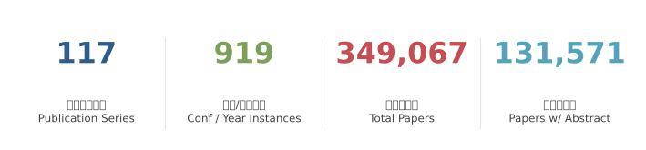
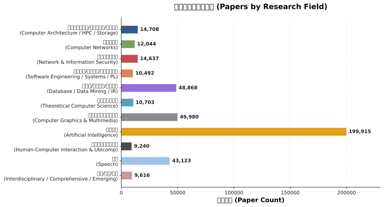
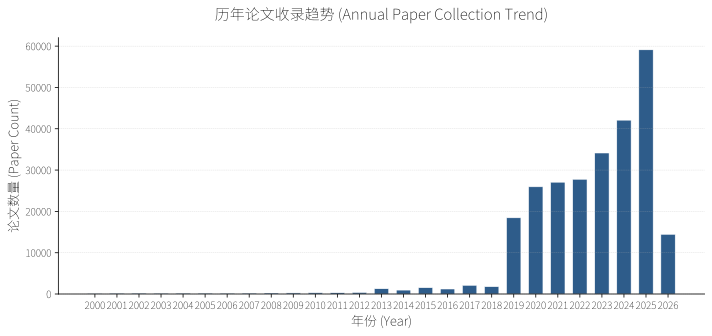
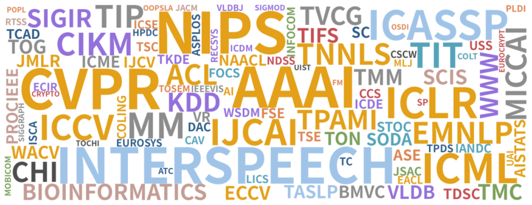

<h1 align="center">  PaperVault</h1>

  <strong>English</strong> | <a href="README.md">简体中文</a>

## :jack_o_lantern: Project Introduction

PaperVault is a fully automated tool for collecting and retrieving academic papers in artificial intelligence, covering top-tier conferences and journals across natural language processing, computer vision, machine learning, data mining, databases, speech, systems, security, networking, and theoretical computer science.

## 🚧 Project Status

> **This project is actively under construction.**

### Recent Update Brief

<!-- recent-update-start -->

- 📅 **Last Updated**: 2026-06-06
- 🆕 **New Papers This Update**: 88,197
- 📢 **New Conferences This Update**: 462
- 📊 **Database Scale**: 349,067 papers / 117 publication series / 131,571 with abstracts

<!-- recent-update-end -->

### Current Phase
<!-- auto-summary-start -->

- The database contains **340,000+** papers spanning 117+ top-tier conferences and journals across NLP, CV, ML, DM, DB, and Speech.

<!-- auto-summary-end -->

### Next Steps
- Upgrade the frontend and backend stack for a better search experience and UI.
- Redeploy and relaunch the web search service.

## :bar_chart: Data Statistics

<!-- stats-start -->

  

  

  

  

📊 [View Interactive Statistics](./docs/stats.html)

<!-- stats-end -->

## :open_book: Coverage

<!-- confs-list-start -->

<b>Computer Architecture / HPC / Storage</b> (16 series)

- **ASPLOS** 2019-2026 (8 editions)
- **ATC** 2019-2025 (7 editions)
- **DAC** 2019-2025 (7 editions)
- **EUROSYS** 2019-2026 (8 editions)
- **FAST** 2019-2026 (8 editions)
- **HPCA** 2019-2026 (8 editions)
- **HPDC** 2019-2025 (7 editions)
- **ISCA** 2019-2025 (7 editions)
- **MICRO** 2019-2025 (7 editions)
- **SC** 2019-2025 (7 editions)
- **TACO** 2019-2026 (8 editions)
- **TC** 2019-2026 (8 editions)
- **TCAD** 2019-2026 (8 editions)
- **TOCS** 2019-2026 (8 editions)
- **TOS** 2019-2026 (7 editions)
- **TPDS** 2020-2026 (7 editions)

<b>Computer Networks</b> (7 series)

- **INFOCOM** 2019-2025 (7 editions)
- **JSAC** 2019-2026 (8 editions)
- **MOBICOM** 2019-2025 (7 editions)
- **NSDI** 2019-2026 (8 editions)
- **SIGCOMM** 2019-2025 (7 editions)
- **TMC** 2019-2026 (8 editions)
- **TON** 2019-2026 (8 editions)

<b>Network & Information Security</b> (9 series)

- **CCS** 2019-2025 (7 editions)
- **CRYPTO** 2019-2025 (7 editions)
- **EUROCRYPT** 2019-2026 (8 editions)
- **JOC** 2019-2026 (8 editions)
- **NDSS** 2019-2026 (8 editions)
- **SP** 2019-2025 (7 editions)
- **TDSC** 2019-2026 (8 editions)
- **TIFS** 2019-2026 (8 editions)
- **USS** 2019-2025 (7 editions)

<b>Software Engineering / Systems / PL</b> (12 series)

- **ASE** 2019-2025 (7 editions)
- **FM** 2019-2026 (5 editions)
- **FSE** 2019-2023 (5 editions)
- **ICSE** 2019-2025 (7 editions)
- **ISSTA** 2019-2024 (6 editions)
- **OSDI** 2020-2025 (6 editions)
- **PLDI** 2019-2022 (4 editions)
- **SOSP** 2019-2025 (5 editions)
- **TOPLAS** 2019-2026 (8 editions)
- **TOSEM** 2019-2026 (8 editions)
- **TSC** 2019-2026 (8 editions)
- **TSE** 2019-2026 (8 editions)

<b>Database / Data Mining / IR</b> (15 series)

- **CIKM** 2019-2025 (7 editions)
- **ECIR** 2019-2026 (8 editions)
- **ICDE** 2019-2025 (7 editions)
- **ICDM** 2019-2025 (7 editions)
- **KDD** 2019-2026 (8 editions)
- **RECSYS** 2019-2025 (7 editions)
- **SIGIR** 2019-2025 (7 editions)
- **SIGMOD** 2019-2022 (4 editions)
- **TKDE** 2019-2025 (7 editions)
- **TODS** 2019-2026 (8 editions)
- **TOIS** 2019-2025 (7 editions)
- **VLDB** 2019-2025 (7 editions)
- **VLDBJ** 2019-2026 (8 editions)
- **WSDM** 2019-2026 (8 editions)
- **WWW** 2019-2026 (8 editions)

<b>Theoretical Computer Science</b> (10 series)

- **ALT** 2019-2025 (7 editions)
- **CAV** 2019-2025 (7 editions)
- **COLT** 2019-2025 (7 editions)
- **FOCS** 2019-2025 (7 editions)
- **IANDC** 2019-2026 (8 editions)
- **LICS** 2019-2025 (7 editions)
- **SICOMP** 2019-2026 (8 editions)
- **SODA** 2019-2026 (8 editions)
- **STOC** 2019-2025 (7 editions)
- **TIT** 2019-2026 (8 editions)

<b>Computer Graphics & Multimedia</b> (11 series)

- **BMVC** 2019-2024 (6 editions)
- **ICME** 2019-2025 (7 editions)
- **IEEEVIS** 2019-2024 (6 editions)
- **MICCAI** 2019-2025 (7 editions)
- **MM** 2019-2025 (7 editions)
- **SIGGRAPH** 2022-2025 (4 editions)
- **TIP** 2019-2026 (8 editions)
- **TMM** 2019-2026 (8 editions)
- **TOG** 2019-2026 (8 editions)
- **TVCG** 2019-2026 (8 editions)
- **VR** 2019-2026 (8 editions)

<b>Artificial Intelligence</b> (23 series)

- **AAAI** 2019-2026 (8 editions)
- **ACL** 2000-2025 (26 editions)
- **AI** 2019-2026 (8 editions)
- **AISTATS** 2019-2025 (7 editions)
- **COLING** 2000-2025 (14 editions)
- **CVPR** 2013-2026 (14 editions)
- **EACL** 2003-2026 (10 editions)
- **ECCV** 2018-2024 (4 editions)
- **EMNLP** 2000-2025 (26 editions)
- **ICCV** 2013-2025 (7 editions)
- **ICLR** 2019-2025 (7 editions)
- **ICML** 2019-2025 (7 editions)
- **IJCAI** 2019-2025 (7 editions)
- **IJCV** 2019-2026 (8 editions)
- **JMLR** 2019-2026 (8 editions)
- **MLJ** 2019-2026 (8 editions)
- **MLSYS** 2019-2025 (7 editions)
- **NAACL** 2000-2025 (18 editions)
- **NIPS** 2000-2025 (26 editions)
- **TNNLS** 2019-2025 (7 editions)
- **TPAMI** 2019-2026 (8 editions)
- **UAI** 2019-2025 (7 editions)
- **WACV** 2020-2026 (7 editions)

<b>Human-Computer Interaction & Ubicomp</b> (4 series)

- **CHI** 2019-2026 (8 editions)
- **TOCHI** 2019-2026 (8 editions)
- **UBICOMP** 2019-2019
- **UIST** 2019-2025 (7 editions)

<b>Speech</b> (3 series)

- **ICASSP** 2019-2025 (7 editions)
- **INTERSPEECH** 2019-2025 (7 editions)
- **TASLP** 2019-2024 (6 editions)

<b>Interdisciplinary / Comprehensive / Emerging</b> (6 series)

- **BIOINFORMATICS** 2019-2026 (7 editions)
- **ISWC** 2019-2022 (4 editions)
- **JACM** 2019-2026 (8 editions)
- **PROCIEEE** 2019-2025 (7 editions)
- **RTSS** 2019-2025 (7 editions)
- **SCIS** 2019-2026 (8 editions)

<b>Others</b> (1 series)

- **PPOPP** 2019-2026 (8 editions)

<!-- confs-list-end -->

## :warning: Disclaimer

Due to limitations in data sources and retrieval mechanisms, we can not guarantee that the papers found will meet your needs. In addition, all the results come from [DBLP](https://dblp.org/), [ACL](https://aclanthology.org/), [NIPS](https://papers.nips.cc/), [OpenReview](https://openreview.net/), if this violates your copyright, you can contact us at any time, we will delete it as soon as possible, thank you:)

## :scroll: Acknowledgements

This project is forked from [MLNLP-World/AI-Paper-Collector](https://github.com/MLNLP-World/AI-Paper-Collector) and is now developed independently as **PaperVault**. We sincerely thank the original authors and contributors for laying the foundation. This project continues under the [GNU General Public License v3.0](LICENSE).

---

📄 [Technical Details](TECHNICAL.md)
