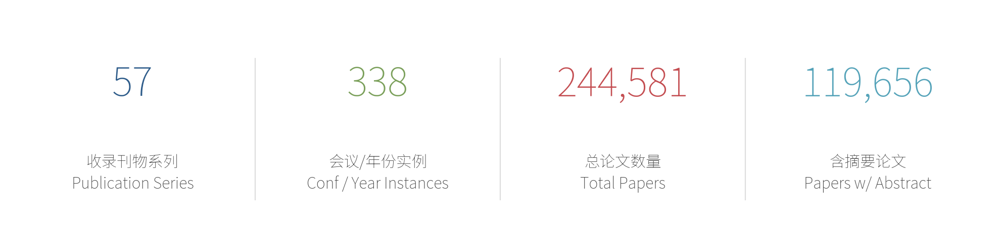
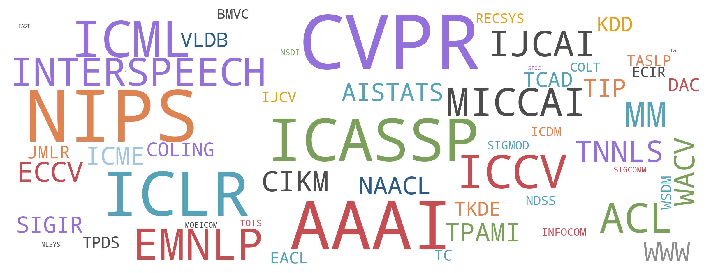
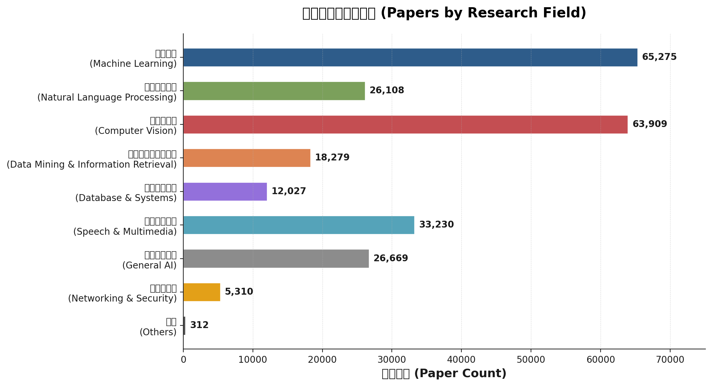
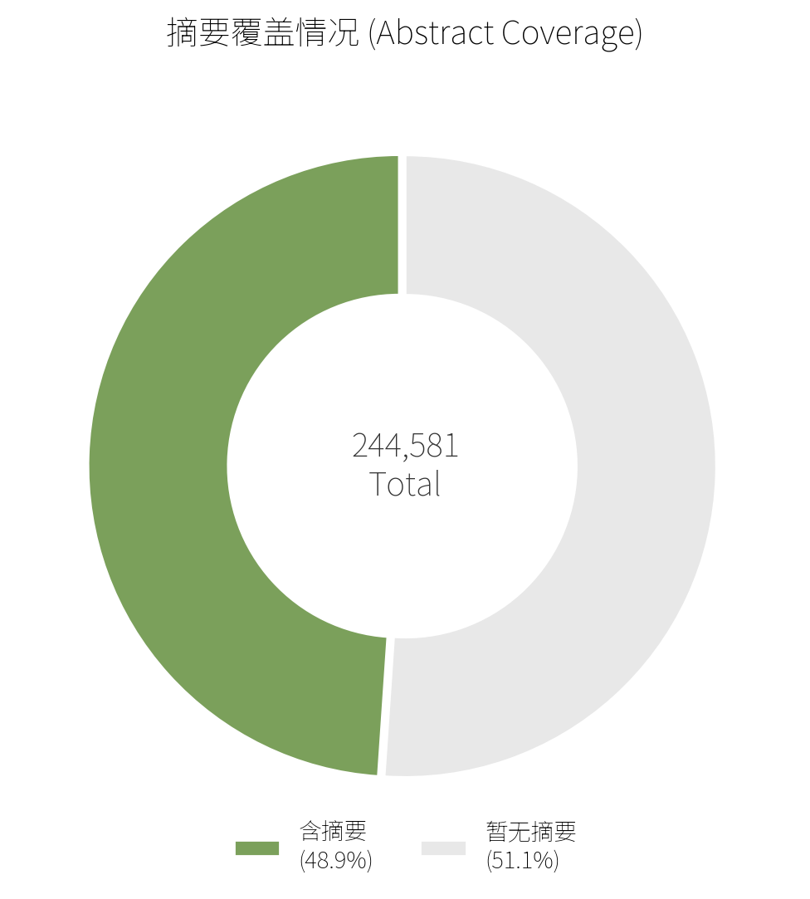
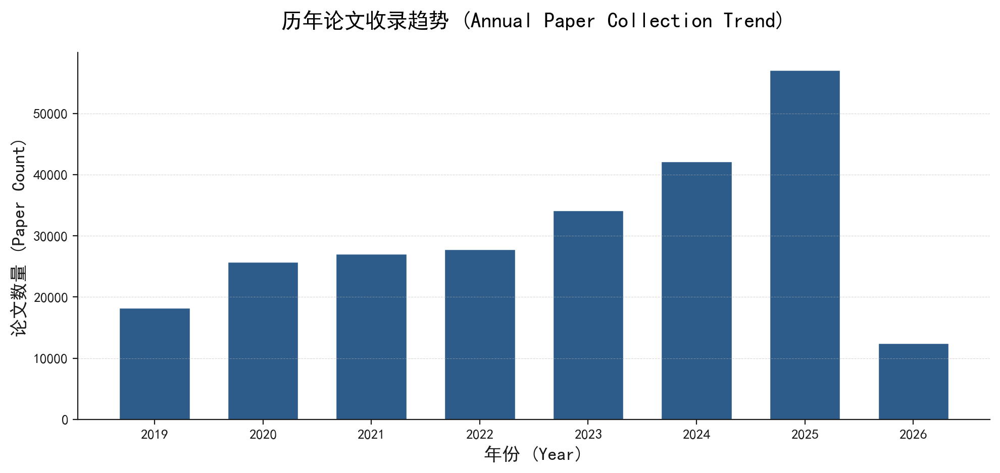

<h1 align="center">  PaperVault</h1>

  <strong>English</strong> | <a href="README.md">简体中文</a>

## :jack_o_lantern: Project Introduction

PaperVault is a fully automated tool for collecting and retrieving academic papers in artificial intelligence, covering top-tier conferences and journals across natural language processing, computer vision, machine learning, data mining, databases, speech, systems, security, networking, and theoretical computer science.

## 🚧 Project Status

> **This project is actively under construction.**

### Recent Update Brief

<!-- recent-update-start -->

- 📅 **Last Updated**: 2026-06-04
- 🆕 **New Papers This Update**: 0
- 📊 **Database Scale**: 244,581 papers / 57 publication series / 119,656 with abstracts

<!-- recent-update-end -->

### Current Phase
- Expanding paper coverage from 2020 onward, especially high-quality **journals** (e.g., TIP, TPAMI, TKDE, TNNLS, TASLP, IJCV, etc.) and major **publishers** (e.g., IEEE, ACM, Springer, Elsevier).
- Backfilling **abstracts** for existing papers via automated scripts and GitHub Actions to enhance searchability.
<!-- auto-summary-start -->

- The database contains **240,000+** papers spanning 57+ top-tier conferences and journals across NLP, CV, ML, DM, DB, and Speech.

<!-- auto-summary-end -->

### Next Steps
- Upgrade the frontend and backend stack for a better search experience and UI.
- Redeploy and relaunch the web search service.

### Project History
PaperVault is evolving from a static paper list into a fully-featured, data-rich online academic search engine.

## :bar_chart: Data Statistics

<!-- stats-start -->

  

  

<table>
  <tr>
    <td align="center"></td>
    <td align="center"></td>
  </tr>
</table>

  

<!-- stats-end -->

## :open_book: Coverage

<!-- confs-list-start -->

<b>Machine Learning</b> (9 series)

- **AI** 2020-2025 (4 editions)
- **AISTATS** 2019-2025 (7 editions)
- **COLT** 2019-2025 (7 editions)
- **ICLR** 2019-2025 (7 editions)
- **ICML** 2019-2025 (7 editions)
- **JMLR** 2019-2025 (7 editions)
- **MLSYS** 2019-2025 (7 editions)
- **NIPS** 2019-2025 (7 editions)
- **TNNLS** 2020-2025 (6 editions)

<b>Natural Language Processing</b> (6 series)

- **ACL** 2019-2025 (7 editions)
- **COLING** 2020-2025 (4 editions)
- **EACL** 2021-2026 (4 editions)
- **EMNLP** 2019-2025 (7 editions)
- **NAACL** 2019-2025 (5 editions)
- **TASLP** 2020-2024 (5 editions)

<b>Computer Vision</b> (9 series)

- **BMVC** 2019-2024 (4 editions)
- **CVPR** 2019-2026 (8 editions)
- **ECCV** 2020-2024 (3 editions)
- **ICCV** 2019-2025 (4 editions)
- **IJCV** 2020-2025 (6 editions)
- **MICCAI** 2019-2025 (7 editions)
- **TIP** 2020-2025 (6 editions)
- **TPAMI** 2020-2025 (6 editions)
- **WACV** 2020-2026 (7 editions)

<b>Data Mining & Information Retrieval</b> (8 series)

- **CIKM** 2019-2025 (7 editions)
- **ECIR** 2019-2025 (7 editions)
- **ICDM** 2019-2025 (6 editions)
- **KDD** 2019-2024 (5 editions)
- **RECSYS** 2019-2025 (7 editions)
- **SIGIR** 2019-2025 (7 editions)
- **WSDM** 2019-2026 (8 editions)
- **WWW** 2019-2026 (8 editions)

<b>Database & Systems</b> (9 series)

- **FAST** 2019-2025 (6 editions)
- **SIGMOD** 2019-2022 (4 editions)
- **TC** 2019-2026 (7 editions)
- **TCAD** 2020-2026 (7 editions)
- **TKDE** 2020-2025 (6 editions)
- **TOIS** 2020-2025 (6 editions)
- **TOS** 2024-2026 (3 editions)
- **TPDS** 2020-2026 (7 editions)
- **VLDB** 2019-2025 (7 editions)

<b>Speech & Multimedia</b> (4 series)

- **ICASSP** 2019-2025 (7 editions)
- **ICME** 2019-2025 (7 editions)
- **INTERSPEECH** 2019-2025 (7 editions)
- **MM** 2019-2025 (7 editions)

<b>General AI</b> (3 series)

- **AAAI** 2019-2026 (8 editions)
- **IJCAI** 2019-2025 (7 editions)
- **MLJ** 2019-2026 (6 editions)

<b>Networking & Security</b> (7 series)

- **DAC** 2020-2025 (6 editions)
- **INFOCOM** 2019-2021 (3 editions)
- **MOBICOM** 2022-2025 (3 editions)
- **NDSS** 2019-2026 (8 editions)
- **NSDI** 2019-2025 (6 editions)
- **SIGCOMM** 2020-2025 (6 editions)
- **SP** 2019-2020 (2 editions)

<b>Others</b> (2 series)

- **ISWC** 2019-2022 (4 editions)
- **STOC** 2025-2025

<!-- confs-list-end -->

## :warning: Disclaimer

Due to limitations in data sources and retrieval mechanisms, we can not guarantee that the papers found will meet your needs. In addition, all the results come from [DBLP](https://dblp.org/), [ACL](https://aclanthology.org/), [NIPS](https://papers.nips.cc/), [OpenReview](https://openreview.net/), if this violates your copyright, you can contact us at any time, we will delete it as soon as possible, thank you:)

## :scroll: Acknowledgements

This project is forked from [MLNLP-World/AI-Paper-Collector](https://github.com/MLNLP-World/AI-Paper-Collector) and is now developed independently as **PaperVault**. We sincerely thank the original authors and contributors for laying the foundation. This project continues under the [GNU General Public License v3.0](LICENSE).

---

📄 [Technical Details](TECHNICAL.md)
